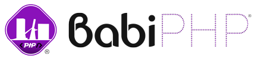

<!-- _coverpage.md -->

<!---->

# BabiPHP <small>2.0.0-beta.1</small>

> The flexible PHP Framework.

- Un Framework <i>ready-to-use</i> (prêt à l'emploi),
- Une interface simple et une structure logique,
- Accessible, mais puissant

[GitHub](https://github.com/lambirou/babiphp/)
[Get Started](#qu39est-ce-que-babiphp)
